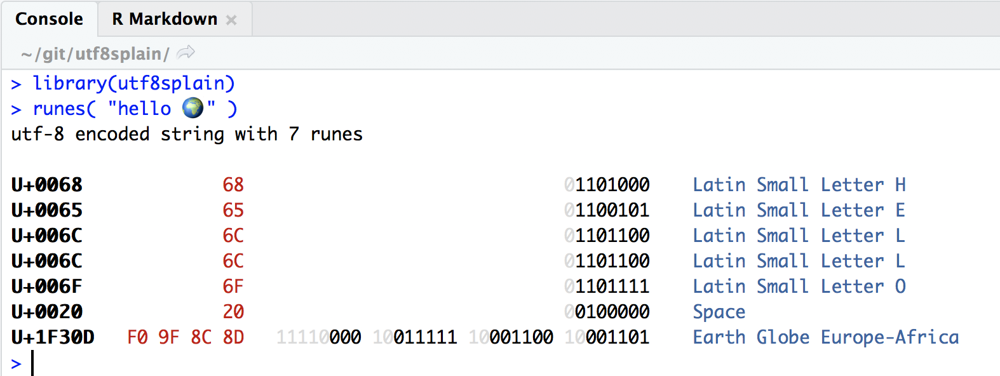

# utf8splain <a href="https://github.com/ThinkR-open/utf8splain"></a>

## Installation from github

``` r
devtools::install_github( "ThinkR-open/utf8splain")
```

## Split a string into bytes

``` r
bytes( "hello 🌍" )
#> # A tibble: 10 × 4
#>       id byte  decimal binary  
#>    <int> <raw>   <int> <chr>   
#>  1     1 68        104 01101000
#>  2     2 65        101 01100101
#>  3     3 6c        108 01101100
#>  4     4 6c        108 01101100
#>  5     5 6f        111 01101111
#>  6     6 20         32 00100000
#>  7     7 f0        240 11110000
#>  8     8 9f        159 10011111
#>  9     9 8c        140 10001100
#> 10    10 8d        141 10001101
```

## Split a utf-8 encoded string into unicode runes

If you run it in a [crayon](https://github.com/r-lib/crayon) compatible
terminal, for example a recent enough version of rstudio, the `print`
method gives you a nicer output:



## Details about unicode and utf-8

utf-8 encoded strings are divided in a series of runes (aka unicode code
points) from the [unicode table](https://unicode-table.com/en/), for
example the rune for the lower case “h” is
[U+0068](https://unicode-table.com/en/#0068).

Each rune is encoded in a variable number of bytes, depending on how far
it is in the table, for example “h” (and all other ascii characters)
only need one byte, but 🌍 needs 4 bytes.

utf-8 bytes are organised as follows: - the first byte of a rune starts
with as many 1 as the rune needs bytes, followed by a 0, e.g. the first
rune for the utf-8 encoded 🌍 starts with “11110”, and the only byte of
the encoded “h” starts with “0” - the remaining bytes (if any) all start
with “10”

All the bits that are not taken are used to store the binary
representation of the rune, for example the 7 bits “1101000” follow the
initial “0” in the encoding of “h”. 🌍 correspond to the rune
[U+1F30D](https://unicode-table.com/en/#1F30D), i.e. the rune number
`0x1F30D`.

``` r
world_decimal <- strtoi( "0x1F30D", base = 16)
world_decimal
#> [1] 127757

world_binary    <- paste( substr(as.character( rev(intToBits(world_decimal)) ), 2, 2 ), collapse = "" )
world_binary
#> [1] "00000000000000011111001100001101"

world_binary_signif <- sub( "^0+", "", world_binary )
world_binary_signif
#> [1] "11111001100001101"

nchar(world_binary_signif)
#> [1] 17
```

So 🌍 needs 17 bits, which needs 4 utf-8 bytes.
